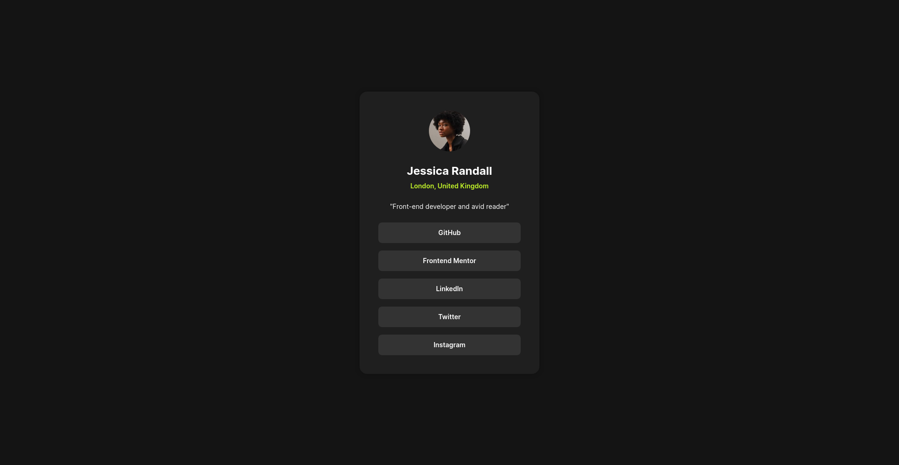

# Frontend Mentor - Social links profile solution

This is a solution to the [Social links profile challenge on Frontend Mentor](https://www.frontendmentor.io/challenges/social-links-profile-UG32l9m6dQ). Frontend Mentor challenges help you improve your coding skills by building realistic projects. 

## Table of contents

- [Frontend Mentor - Social links profile solution](#frontend-mentor---social-links-profile-solution)
  - [Table of contents](#table-of-contents)
  - [Overview](#overview)
    - [The challenge](#the-challenge)
    - [Screenshot](#screenshot)
    - [Links](#links)
  - [My process](#my-process)
    - [Built with](#built-with)
  - [Author](#author)

## Overview

### The challenge

Users should be able to:

- See hover and focus states for all interactive elements on the page

### Screenshot

### Links

- Solution URL: [https://github.com/jceballos29/mentor-frontend/tree/social-links-profile](https://github.com/jceballos29/mentor-frontend/tree/social-links-profile)
- Live Site URL: [https://frontend-mentor-challenges-sage-nine.vercel.app/#/social-links-profile](https://frontend-mentor-challenges-sage-nine.vercel.app/#/social-links-profile)

## My process

### Built with

- Semantic HTML5 markup
- CSS custom properties
- Flexbox
- CSS Grid
- Mobile-first workflow
- [React](https://reactjs.org/) - JS library

## Author

- Website - [Juan Ceballos](https://www.jceballos.dev)
- Frontend Mentor - [@jceballos29](https://www.frontendmentor.io/profile/jceballos29)
- GitHub - [@jceballos29](https://www.github.com/jceballos29)
